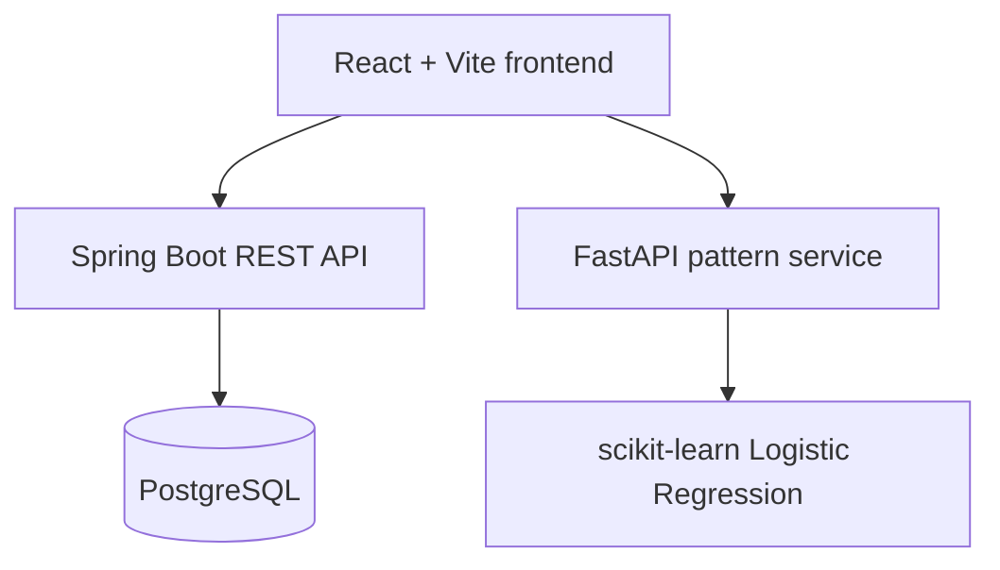

# Sanjeevani

Sanjeevani is an AI-assisted personal health logging, wellness tracking, and health-pattern analysis portfolio MVP. It brings daily wellness notes, vital readings, and symptom observations together with a small dataset-based pattern classifier.

> **Responsible use:** Sanjeevani is not a medical diagnosis system and does not provide medical advice. Model outputs are pattern classifications based on the training dataset. Confidence is not medical certainty. Consult a qualified healthcare professional about medical concerns.

## Features

- Health profile and user registration
- Wellness tracking for sleep, hydration, mood, stress, and activity
- Personal vital tracking
- Symptom and symptom-log recording
- Dashboard totals, latest entries, and a recent sleep trend
- AI-assisted symptom-pattern classification using the saved Logistic Regression model
- Transparent model version, confidence, and unrecognized-feature reporting
- PostgreSQL persistence through Spring Data JPA

## Architecture



## Tech Stack

- Java 21, Spring Boot, Spring Data JPA, Spring Security
- PostgreSQL
- Python, FastAPI, scikit-learn, joblib
- React, Vite

## Running Locally

Start PostgreSQL and create the `sanjeevani_db` database. Configure the backend from the workspace root in PowerShell:

```powershell
$env:DB_URL = "jdbc:postgresql://localhost:5432/sanjeevani_db"
$env:DB_USERNAME = "postgres"
$env:DB_PASSWORD = "<your-local-database-password>"
$env:PORT = "8080"
Set-Location backend/backend
./mvnw.cmd spring-boot:run
```

Hibernate updates the existing schema with `ddl-auto=update`. The REST API is available at `http://localhost:8080`; requests are currently public for this demo MVP and do not use JWT.

In a second terminal, start the model service:

```powershell
Set-Location ml-service
python -m venv .venv
./.venv/Scripts/Activate.ps1
pip install -r requirements.txt
$env:PORT = "8000"
uvicorn main:app --host 0.0.0.0 --port $env:PORT
```

The model service exposes `GET /health` and `POST /predict`. Prediction requests contain symptom names, for example `{"symptoms":["headache","fatigue"]}`. Unknown symptom names are reported and ignored. The classifier reports a training-data pattern, not a user's diagnosis.

In another terminal, start the frontend:

```powershell
Set-Location frontend
Copy-Item .env.example .env.local
npm install
npm run dev
```

The Vite development server prints its local URL. `.env.local` can set `VITE_API_BASE_URL` and `VITE_ML_BASE_URL`; defaults are `http://localhost:8080` and `http://localhost:8000`.

The first frontend visit creates a demo profile. Its ID is saved in the current browser for subsequent log submissions. The MVP has no sign-in or per-user access controls; do not use real sensitive health information.

## API Overview

| Method | Path | Purpose |
| --- | --- | --- |
| GET | `/api/health` | Backend health check |
| POST | `/api/users` | Register a user |
| POST, GET | `/api/profile`, `/api/profile/{id}` | Create and retrieve a health profile |
| POST, GET | `/api/wellness` | Create and list wellness logs |
| POST, GET | `/api/vitals` | Create and list vital logs |
| POST, GET | `/api/symptoms` | Create and list symptom definitions |
| POST, GET | `/api/symptom-logs` | Create and list symptom logs |
| GET | `/api/dashboard` | Log counts and latest wellness, vital, and symptom entries |
| GET | `/health` | ML service health check |
| POST | `/predict` | Dataset-based symptom-pattern classification |

## Deployment

- **Frontend → Vercel:** set the project root to `frontend`, build with `npm run build`, output `dist`. Configure `VITE_API_BASE_URL` and `VITE_ML_BASE_URL` with the deployed service URLs.
- **Backend → Render:** create a Java 21 web service rooted at `backend/backend`. Build with `./mvnw clean package -DskipTests`; start with `java -jar target/backend-0.0.1-SNAPSHOT.jar`. Set `DB_URL` to the JDBC form `jdbc:postgresql://<host>:<port>/<database>` (prepend `jdbc:` to Render's PostgreSQL URL), and set `DB_USERNAME`, `DB_PASSWORD`, and `CORS_ALLOWED_ORIGIN` to the database credentials and Vercel origin. Render supplies `PORT`.
- **ML service → Render:** create a Python web service rooted at `ml-service`. Build with `pip install -r requirements.txt`; start with `uvicorn main:app --host 0.0.0.0 --port $PORT`. Set `CORS_ALLOWED_ORIGIN` to the Vercel origin. Keep both saved model files in the service repository under `models/`.
- **Database → PostgreSQL/Render:** create the database, then use its internal connection URL, username, and password as the backend `DB_*` environment variables. Never put secrets in frontend variables or source files.

Configure backend and ML CORS origins to match the exact deployed frontend origin. After deployment, verify the service health endpoints and submit a demo log from the frontend.
